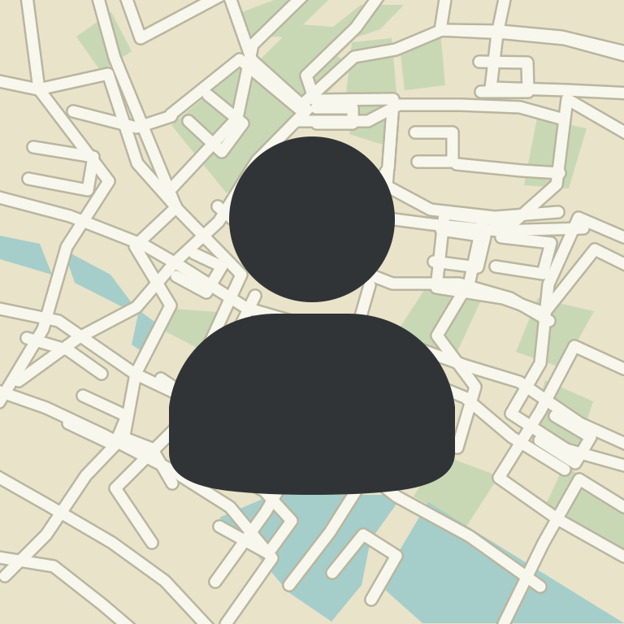

# Person Map Card



A Lovelace card for Home Assistant that shows a person (or a `device_tracker`) on an
**OpenStreetMap** background. It is inspired by the community card
["Person card with static map API background"](https://community.home-assistant.io/t/person-card-with-static-map-api-background/736643),
but needs **no API key**.

By default the card embeds Home Assistant's own map (Home Assistant 2026.10+), so the background
looks exactly like the built-in map, in light and dark mode, with tiles served and cached by Home Assistant.
CARTO and Geoapify styles can be used with your own free API key. No build step needed.

<br clear="left">

## Features

- Map background identical to Home Assistant's built-in map, **no API key needed**; optional CARTO or Geoapify styles with a free key
- Light tint in the card background color and a theme-aware text and icon shadow with adjustable size (like the card-mod styling of the original)
- Adjustable profile picture size
- Marker and badge icon and color per zone (`home` green, away red, custom zones configurable)
- Position can come from a separate `device_tracker` (e.g. your phone)
- Address from the Companion App's "Geocoded Location" sensor
- No other dependencies (no stack-in-card, mushroom or card-mod needed)
- Visual editor in the dashboard (the API key field only appears for the selected provider)

## Installation via HACS

[](https://my.home-assistant.io/redirect/hacs_repository/?owner=ElVit&repository=person-map-card)

1. HACS → **⋮** (top right) → **Custom repositories**
2. Add `https://github.com/ElVit/person-map-card` with type **Dashboard**
3. Search for "Person Map Card" and download it
4. Reload your browser (HACS adds the dashboard resource automatically)

### Manual installation

Copy `person-map-card.js` to `/config/www/` and add it under
*Settings → Dashboards → Resources* as `/local/person-map-card.js` (type *JavaScript module*).

## Configuration

Example config:

```yaml
type: custom:person-map-card
entity: person.MY_PERSON
tracker: device_tracker.MY_IPHONE
geocoded_sensor: sensor.MY_IPHONE_geocoded_location
zoom: 14
zones:
  MY_WORK:
    icon: mdi:office-building
    color: blue
entities:
  - sensor.MY_IPHONE_steps
  - sensor.MY_IPHONE_battery_state
```

| Option                | Type    | Default  | Description |
|-----------------------|---------|----------|-------------|
| `entity`              | string  | –        | **Required.** `person.*` or `device_tracker.*` |
| `tracker`             | string  | –        | `device_tracker` whose coordinates are used for the map (otherwise those of the person or its zone) |
| `geocoded_sensor`     | string  | –        | Companion App "Geocoded Location" sensor for the address |
| `geocoded_attributes` | list    | `[Name, Postal Code, Sub Locality]` | Attributes used for the address, formatted as `first, rest rest` |
| `name`                | string  | Friendly name | Displayed name |
| `picture`             | string  | `entity_picture` | Custom profile picture |
| `zones`               | map     | –        | Icon/color per state, zone name or zone entity id, e.g. `Work: {icon: mdi:office-building, color: blue}`; `marker_icon` sets a different marker icon (`""` = plain pin) |
| `map_style`           | string  | `ha`     | Map provider: `ha`, `osm`, `carto` or `geoapify` (see below) |
| `carto_api_key`       | string  | –        | API key for the CARTO styles |
| `geoapify_api_key`    | string  | –        | API key for the Geoapify styles |
| `api_key`             | string  | –        | Key inserted for `{api_key}` in `tile_url`; fallback for the two options above |
| `theme`               | string  | `auto`   | `auto` (follows the Home Assistant theme), `light` or `dark` – map look, text and icon color (dark text on light, white text on dark) and shadow |
| `tile_url`            | string  | –        | Custom tile server, e.g. `https://tile.example.org/{z}/{x}/{y}.png?key={api_key}` (`{s}`, `{r}` and `{api_key}` are supported) |
| `attribution`         | string  | OSM      | Attribution for `tile_url` |
| `zoom`                | number  | `14`     | Zoom level (1–19) |
| `spacer`              | number  | `40`     | Height of the free map area between header and chips (px) |
| `tint`                | number  | `0.3`    | Opacity of the card-background tint over the map (0–1) |
| `picture_size`        | number  | `60`     | Size of the profile picture (px); the badge scales with it |
| `marker_size`         | number  | `32`     | Size of the map marker (px); the icon scales with it |
| `marker_offset_x`     | number  | `0`      | Moves the marker horizontally (px, positive = right); the map moves with it |
| `marker_offset_y`     | number  | `0`      | Moves the marker vertically (px, positive = down); the map moves with it |
| `shadow_size`         | number  | `1`      | Size of the text and icon shadow (`0` = off, `2` = twice as large) |
| `shadow_color`        | string  | `auto`   | Color of the text and icon shadow: `auto` (white on light, black on dark), `black`, `white` or any CSS color |
| `show_marker`         | boolean | `true`   | Show the marker on the map |
| `show_accuracy`       | boolean | `false`  | Show the GPS accuracy circle |
| `show_state`          | boolean | `true`   | Show the state in the second line |
| `show_last_changed`   | boolean | `false`  | Show "x minutes ago" in the second line |
| `grayscale_away`      | boolean | `false`  | Gray map when the person is `not_home` |
| `entities`            | list    | `[]`     | Chips (`- sensor.x` or `- entity: sensor.x` + `icon:`) |

Default zones (badge icon / marker / color):

| State | Badge | Marker | Color |
|-------|-------|--------|-------|
| `home` | `mdi:home` | `mdi:home` | green |
| `not_home` (away) | `mdi:home-export-outline` | plain pin | red |
| other zone | zone icon (or `mdi:map-marker`) | zone icon (or plain pin) | blue |

Colors: `green`, `blue`, `red`, `orange`, `yellow`, `purple`, `teal`, `cyan`, `pink`, `amber`, `grey`, `indigo`,
`light-green` or any CSS value.

## Map styles

`map_style` selects the provider, `theme` selects its light or dark look.

| `map_style` | Light | Dark | API key |
|-------------|-------|------|---------|
| `ha` (default) | Home Assistant map | Home Assistant map (dark) | not needed – embeds Home Assistant's own map (2026.10+), so it looks exactly like the built-in map; falls back to OSM tiles via the `map_tiles` proxy, or to `osm`, on older versions |
| `osm` | OpenStreetMap | OpenStreetMap, darkened | not needed – loaded directly by the browser |
| `carto` | CARTO Positron | CARTO Dark Matter | **needed** (since 2026) – free key at [carto.com/basemaps/apikey](https://carto.com/basemaps/apikey), option `carto_api_key` |
| `geoapify` | OSM Bright | Dark Matter (yellow roads) | **needed** – free key at [geoapify.com](https://www.geoapify.com/), option `geoapify_api_key` |

Example for Card with Geoapify Map:

```yaml
type: custom:person-map-card
entity: person.MY_PERSON
map_style: geoapify
geoapify_api_key: YOUR_GEOAPIFY_API_KEY
```

> Note: the API key is sent by the browser with every tile request and is visible to
> anyone who can open the dashboard. Restrict the key to your Home Assistant domain in the CARTO / Geoapify console.

## Map tiles

Tiles are loaded directly by the viewer's browser. Please respect the
[OpenStreetMap tile usage policy](https://operations.osmfoundation.org/policies/tiles/).
Private use in Home Assistant is fine; the attribution is shown on the map.

## License

MIT
